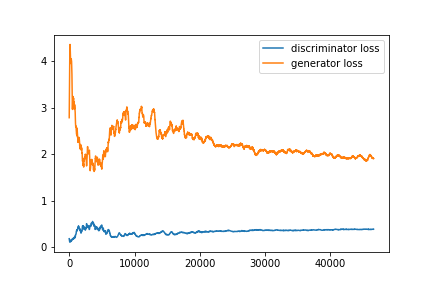
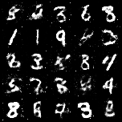

# GAN Survey

## 1/- Introduction
In this project, we train two GAN models on MNIST dataset.

## 2/- Requirements
* Python (3.6)
* PyTorch deep learning framework(1.2.0)
* Torchvision (0.4.0)
* The training was done on an GPU Nvidia GTX1050 

## 3/- Usage
To reproduce the results run:

  ```
  python3 main.py --architecture dcgan
  python3 main.py --architecture dense
  ```
  
## 4/- Results 
### 4.1. Loss

<p float="center">
  
   
</p>


</p>

### 4.1.Samples


<p align="center">
  
  
</p>


